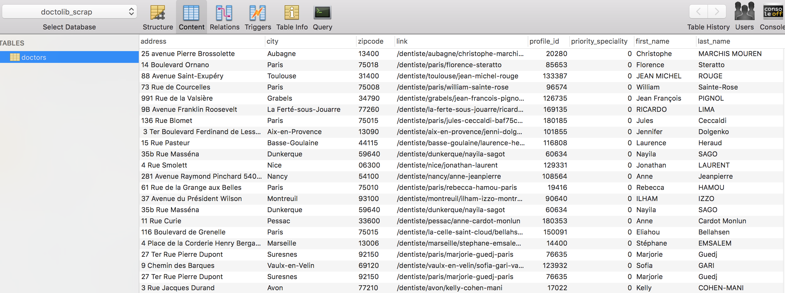

# Doctolib web-scrapping
 
The objective of this project is to get a database of all existing doctors in France, for any kind of speciality to make analysis on Medicine in France.

Doctolib website gives access to doctors registered on the platform & those who are around a location but not on doctolib.

Many information are available and I choose to focus on doctors, places, specility and availability. But you'll find others such as: languages, prices, services.
 
 ## Process
 
 [Flowchart to come]
 
 Tools and ways of working: I made several exploration on the data retrieved from the scrapping on a jupyter notebook (exploration.pynb). Then I created a python script with functions to run the scraping and automatically savong
 
 ## Python concepts used in the web-scrapping
 
 Librairies used:
 - pandas
 - re
 - time
 - datetime
 - requests
 - bs4 (BeautifulSoup)
 - pymysql
 - sqlalchemy
 
 Concepts used:
 - general dataframe manipulations
 - `.json_normalize()` to transform the json into a dataframe
 - html and css selection with `BeautifulSoup()`
 - `.to_sql()` with the `if_exists='append'` argument to save the data after each speciality scraped
 - `.join()`,`.replace()`,`.astype()` to clean data
 - `re.search` and `re.IGNORECASE` to match input user and list of specialities 
 - `.assign()` to create a new column and assign the values
 
 ## Results
 
 #1 A database containing a `doctors` table with all doctors names, address, speciality and, if they propose TeleHealth consultation
 
 
 
 #2 A dataframe with the next availability for a list of doctors based on a location and a speciality
 
 
 
 ## Challenges
 
 - Can't know the number of results to be scraped for a search based on a location and a speciality
 - Scraping taking too much time and risk of loosing data: I changed the way to save the data to my database by sending data scraped after each speciality and appending it in the database instead of saving the data at the end of the scraping
 - Many cases to handle: tests on several random specialities needed to get as many use cases as possible
 
 ## Lesson learned
 
 - How to deal with scalability: go step-by-step when scraping by making sure data is regularly saved and requests are sent based on human behavior
 
 ## Possible improvements
 
 - Enriched the database location using the Address API provided by the gouvernment (https://geo.api.gouv.fr/adresse)
 - Improve scraping time by sending requests with a search url based on region location
 - Fix last use cases on availability

